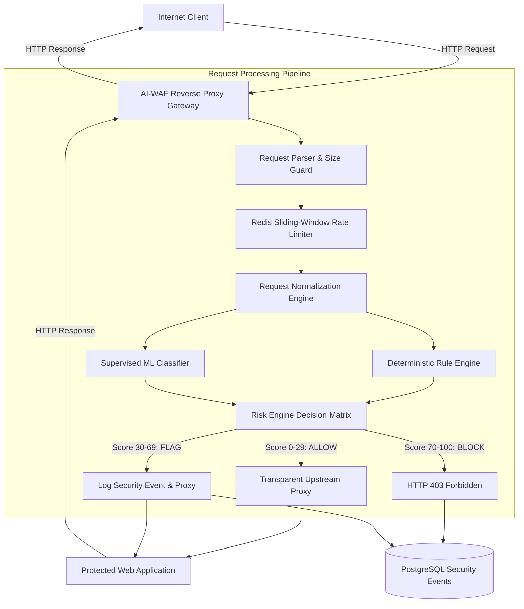

# AI-WAF System Architecture

## 1. Overview
The AI-Powered Web Application Firewall (AI-WAF) operates as a transparent reverse proxy between untrusted internet clients and backend web applications. Every incoming HTTP request is intercepted, parsed, normalized, inspected through multi-tiered detection engines, risk-scored, and either transparently proxied to the upstream target or immediately terminated with an HTTP 403 response.



---

## 2. Request Processing Pipeline

1. **Request Intake & Metadata Capture**:
   - Assign unique `X-Request-ID` (UUIDv4) for distributed tracing.
   - Capture client IP (handling `X-Forwarded-For` with trust verification), HTTP method, URI, headers, query parameters, cookies, and payload.
   - Enforce maximum body size (`MAX_REQUEST_BODY_SIZE`) and maximum header size (`MAX_HEADER_SIZE`).

2. **Rate Limiting**:
   - Query Redis for client IP sliding-window counters.
   - If rate limits are violated, short-circuit immediately with HTTP 429 and log rate-limit violation.

3. **Normalization (Multi-pass)**:
   - Preserve `raw_request` for forensic logging.
   - Generate `normalized_request` through URL decoding, HTML entity decoding, Unicode normalization (NFKC), whitespace compression, and path canonicalization.

4. **Multi-Tier Threat Analysis**:
   - **Deterministic Rule Engine**: Inspects for SQLi, XSS, RCE, and Path Traversal indicators.
   - **Supervised ML Classifier**: TF-IDF vectorizer + Character n-grams + Logistic Regression classifier executing locally in < 5ms without external LLM latency.

5. **Risk Engine & Policy Enforcement**:
   - Combines rule confidence scores and ML attack probabilities into a normalized 0–100 risk score.
   - Evaluates thresholds:
     - 0–29: `ALLOW`
     - 30–69: `FLAG`
     - 70–100: `BLOCK`

6. **Persistence & Upstream Proxy**:
   - Asynchronously records security events into PostgreSQL.
   - If allowed/flagged, streams request to configured upstream destination using connection-pooled HTTP client (`httpx`).

---

## 7. High-Performance Reverse Proxy Gateway (Phase 6)

The reverse proxy gateway brokers traffic between internet clients and the protected web application:

### 7.1 Multi-Method Support
- Transparently proxies `GET`, `POST`, `PUT`, `DELETE`, `PATCH`, `HEAD`, and `OPTIONS` maintaining exact request methods and bodies.

### 7.2 RFC 7230 Hop-by-Hop Sanitization
- Strictly removes hop-by-hop headers per RFC 7230:
  `Connection`, `Keep-Alive`, `Proxy-Authenticate`, `Proxy-Authorization`, `TE`, `Trailers`, `Transfer-Encoding`, and `Upgrade`.
- Preserves end-to-end headers (`Cookie`, `Authorization`, `Content-Type`, `Accept`, `User-Agent`).

### 7.3 Proxy Tracking & Telemetry Injection
- **Upstream Forwarding Headers**:
  - `X-Forwarded-For`: Appends client IP to the existing chain.
  - `X-Forwarded-Proto`: Records incoming scheme (`http` or `https`).
  - `X-Forwarded-Host`: Preserves original requested host.
  - `X-Request-ID`: Propagates correlation identifier.
- **Downstream Telemetry Injection**:
  - `X-WAF-Action`: Enforcement action (`ALLOW` or `FLAG`).
  - `X-WAF-Risk-Score`: Composite risk score ($0 - 100$).
  - `X-WAF-Category`: Threat classification category.
  - `X-WAF-Latency`: Total inspection and processing latency.

### 7.4 Request & Response Streaming
- Leverages `StreamingResponse(upstream_resp.aiter_raw(), ...)` with `BackgroundTask(upstream_resp.aclose)` to forward upstream chunked transfers and large files without unbounded memory buffering.

### 7.5 Connection Pooling & Resilient Error Handling
- Persistent `httpx.AsyncClient` with pooled keepalive connections (up to 200 connections, 50 keepalive, 30s expiry).
- **Error Responses**:
  - Upstream unreachable (`httpx.ConnectError`): HTTP 502 Bad Gateway with structured JSON error.
  - Upstream timeout (`httpx.ReadTimeout`): HTTP 504 Gateway Timeout with structured JSON error.
  - Body exceeds `MAX_REQUEST_BODY_SIZE`: HTTP 413 Payload Too Large.

---

## 8. Redis Sliding-Window Rate Limiting & Burst Protection (Phase 8)

### 8.1 Two-Tier Architecture
1. **Standard Sliding-Window**: Evaluates sliding-window request volume across a configurable time window (default: 100 req / 60s) via Redis sorted sets.
2. **Instantaneous Burst Protection**: Evaluates high-frequency spikes within a micro-window (default: 25 req / 2.0s) to instantly throttle automated Layer 7 flood attacks and credential stuffing tools before normal windows elapse.

### 8.2 Atomic Sorted Set Algorithm
```redis
ZREMRANGEBYSCORE waf:ratelimit:<ip> 0 <window_start>
ZADD waf:ratelimit:<ip> <timestamp> <timestamp>
ZCARD waf:ratelimit:<ip>
ZCOUNT waf:ratelimit:<ip> <burst_start> +inf
EXPIRE waf:ratelimit:<ip> <ttl>
```

### 8.3 Circuit-Breaker In-Memory Fallback
- Automatic failover: If Redis is offline or network-partitioned, a thread-safe local in-memory sliding window cache activates with zero latency penalty.
- Auto-recovery: Re-tests Redis connectivity after a cooldown period.

### 8.4 Standard HTTP 429 Responses
- **Payload**: `{"error": "Too Many Requests", "request_id": "...", "message": "...", "retry_after": ...}`
- **Headers**:
  - `Retry-After: <seconds>`
  - `X-RateLimit-Limit: <limit>`
  - `X-RateLimit-Remaining: 0`
  - `X-RateLimit-Reset: <reset_timestamp>`
  - `X-WAF-Action: RATE_LIMITED`

---

## 9. Interactive Security Monitoring Dashboard (Phase 9)

### 9.1 Dashboard Architecture
The frontend is built with React, Vite, TypeScript, and TailwindCSS, communicating asynchronously with the AI-WAF REST API:
- `GET /api/v1/security-events`: Filtered, paginated security audit trail.
- `GET /api/v1/security-events/summary`: Real-time aggregated statistics (total requests, threat rate %, blocked attacks, avg latency, attack distribution).
- `GET /api/v1/security-events/{id}`: Deep forensic explainability breakdown.
- `GET /api/v1/applications` & `PATCH /api/v1/applications/{id}`: Protected upstream multi-tenant management.
- `GET /api/v1/rules` & `PATCH /api/v1/rules/{rule_id}`: Dynamic rule status toggling and severity score tuning.

### 9.2 Visualization & Forensic Telemetry
1. **Threat Analytics Chart**:
   - Real-time SVG traffic timeline detailing continuous request volume categorized by enforcement action (Allowed, Flagged, Blocked).
   - Attack category distribution donut / progress breakdown (SQLi, XSS, RCE, Path Traversal, Rate Limit).
2. **Interactive Security Events Table**:
   - Live audit trail with search, action filtering (BLOCK, FLAG, ALLOW), category filtering, and risk score visual gauges.
3. **Forensic Explainability Modal**:
   - Deep inspection inspector revealing composite risk scores, supervised ML prediction confidence, deterministic rule matches, contextual threat penalties, and normalized payload comparisons.
4. **Interactive Attack Simulator & Burst Flooder**:
   - Direct live attack probe launcher equipped with pre-configured attack vectors (SQLi, XSS, RCE, Traversal, Normal, Burst flood) showing real-time response telemetry (`X-WAF-Action`, `X-WAF-Risk-Score`, latency).


